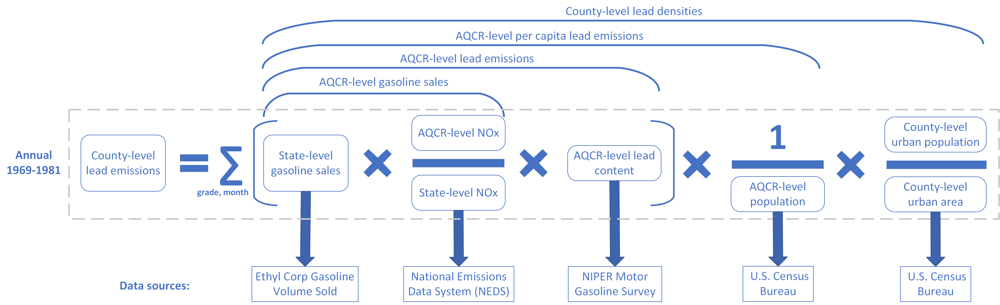

# Annual county-level lead (Pb) vehicle emissions data (1969 to 1981)

This page provides data and code for the paper "Effects of Early-Childhood Exposure to Ambient Lead and Particulate Matter on Adult Personality."

At this stage, only the metadata and R code are publicly available. The full dataset will be posted on this page upon publication of the paper.

## Methodology

## Data Sources
1)	Quantity sold in gallons, by month and grade, or leaded and unleaded fuel, by state and for DC. 
    - Ethyl Corporation (Petroleum Chemicals Division) provides these data in its Yearly Report of Gasoline Sales: By States. We found only a hard copy. 
    - These data start in 1970 and run to 1982. The yearly report provides quantity sold of leaded and unleaded premium and nonpremium. The first year of data on unleaded gasoline sales volume is 1975; it made no distinction between unleaded premium and unleaded regular. Sales volume data for both unleaded premium and unleaded nonpremium first appear in 1981. 
    - Data revisions appear in the Report of Gasoline Sales for the following year (Table A2.1).

2)	EPA’s annual National Emissions Report (of National Emissions Data System), beginning in 1972) provides nitrogen oxide (NOx) emissions by state and AQCRs that cover all counties in all states. 
    - When a single AQCR covers parts of multiple states, the National Emissions Report provides NOx emissions data for that AQCR by state. Thus, the AQCR for the DC metropolitan area has NOx emissions reported for MD, VA, and also DC. 
    - Many of these data are described as “preliminary” or still subject to validation by the state. We are unaware of a publicly available report of these data that is not described as “preliminary.” 
    - Murphy (2017) (based on 37 FR 10841) indicates that all AQCRs contain only whole counties. We assign counties to AQCRs using data from Murphy (2017), but also validate the data by comparing them with the FR notice.

3)  Pb content of gasoline (grams per gallon) by grade (premium, regular, unleaded), for each marketing district, which cover the country, by season (summer = J,J,A; winter = D,J,F). 
    - The source is DOE Bartlesville Energy Research Center. The reports appear twice each year, for winter and summer. 
    - Thirty-two states plus DC fall entirely within these 17 marketing districts. We assign all counties in each of these 32 states (and DC) to the appropriate marketing district. 
    - We assign counties in the remaining 16 contiguous states to one or more marketing districts after a detailed review of their boundaries. See Table A2.2 for these 16 states and Figure 1 for a map of the 17 marketing districts. We determine assignments for these counties based on feasibility using case-by-case criteria.  

4)	Census data on county and state-level population, by year
    - Estimates of county populations by calendar year since 1969 are available [here]( https://www.census.gov/data/datasets/time-series/demo/popest/2010s-counties-detail.html). 
    - We use AQCR population to estimate per capita Pb emissions from motor vehicles within an AQCR. 

5)  Urban population and urban area within a county
    - We use census data to estimate population density in the core urban area within the county. 
    - Data for the 1980s are available at [this link]( https://www2.census.gov/prod2/decennial/documents/1980/1980censusofpopu8011uns_bw.pdf) and data for the 1970s are available [here]( https://www.census.gov/library/publications/1973/dec/population-volume-1.html#par_textimage_43). 
